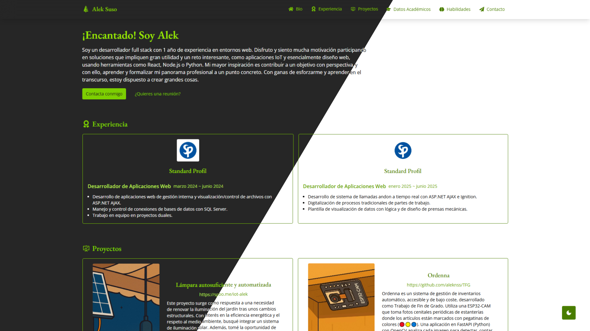

# 🌐 Portfolio - Alek


Mi sitio web personal desarrollado con Vite + React y TailwindCSS para mostrar mis proyectos, habilidades y experiencia profesional. Incluye toda mi experiencia, habilidades, contacto y features como modo oscuro.

**Live**: https://aleknss.github.io/portfolio/

## Índice
- [Tecnologías Utilizadas](#tecnologías-utilizadas)
- [Características](#características)
- [Instalación y Configuración](#instalación-y-configuración)
- [Estructura del Proyecto](#estructura-del-proyecto)
- [Última integración](#última-integración)
- [Próximamente](#próximamente)

## Características
- 🎨 **Diseño Responsive**: Optimizado para móviles, tablets y desktops.
- 🌓 **Modo Oscuro/Claro**: Toggle con persistencia en `localStorage`.
- 🔍 **SEO**: Meta tags dinámicas.

## Instalación y configuración
- Node.js 18.x o superior
- npm o yarn

### Clonar el repositorio
```bash
git clone https://github.com/aleknss/portfolio.git
cd portfolio-web
```
### Instalar dependencias
```bash
npm install
npm run dev
```
Visita: http://localhost:3000

## Estructura del Proyecto
```markdown
portfolio-web/
├── public/                # Assets estáticos
│   └── index.html         # Plantilla HTML
├── src/
│   ├── assets/            # Assets, imágenes
│   ├── components/        # Componentes React reutilizables
│   │   └── ui/
│   ├── pages/             # Parte de páginas
│   │   ├── Home/          # Secciones de Home
│   │   └── Home.tsx
│   ├── contexts/          # Contextos React
│   │   └── ThemeContext.ts
│   ├── layouts/           # Layouts de la página
│   └── App.tsx            # Componente principal
├── .gitignore             # Archivos ignorados por Git
├── package.json           # Dependencias y scripts
└── tsconfig.json          # Configuración de TypeScript
```

## Última integración
18-09-25
¡Nuevo tema! Dedicado a aquellos usuarios que no estén acostumbrados a usar el modo claro y así evitar ese flashbang repentino. Aventura un tono más moderno en comparación al tradicional y clásico anterior.



## Próximamente
- 🌍 Traducción y showcase paralelo a inglés.
- 🐦 Feed integrado de Twitter y Linkedin
- 💻 Integraciones con Github